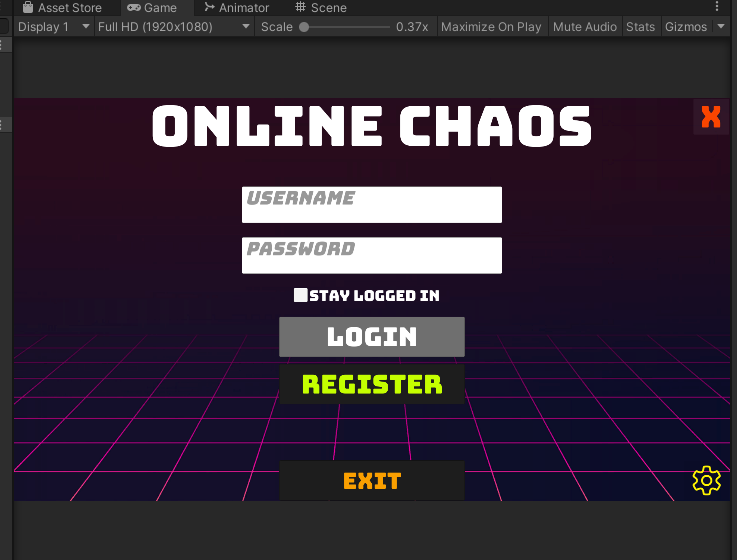
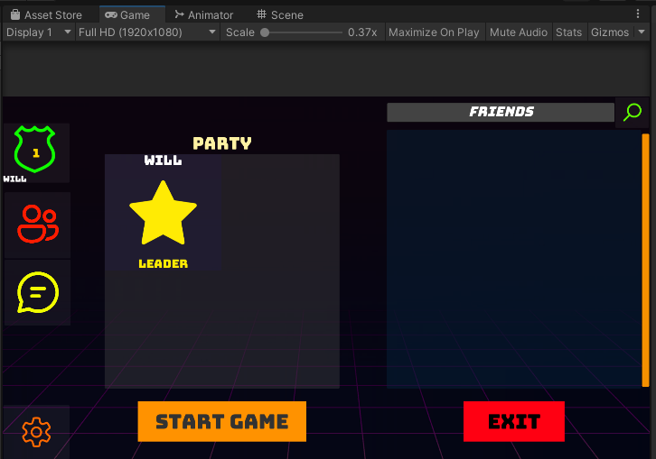
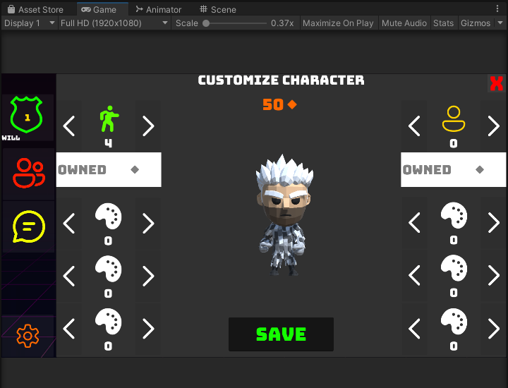
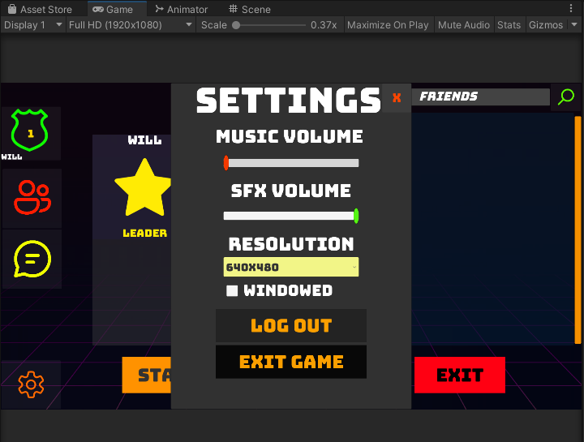
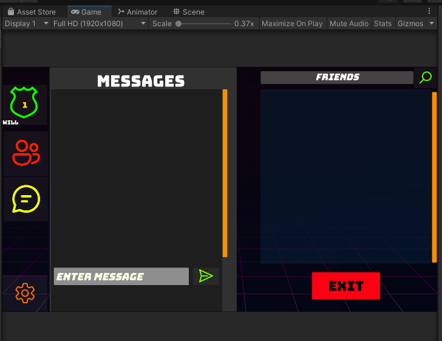
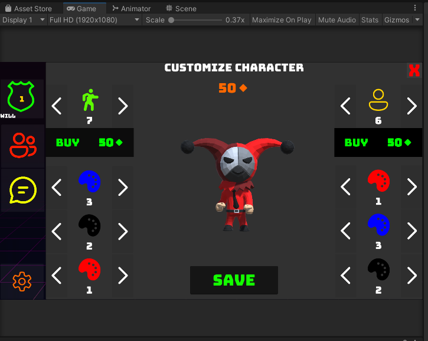
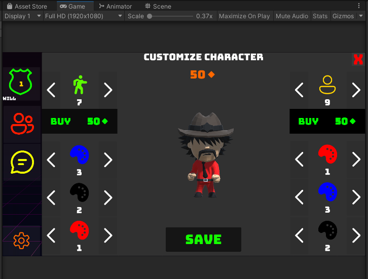
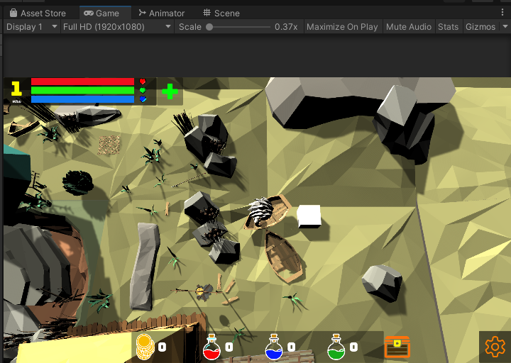
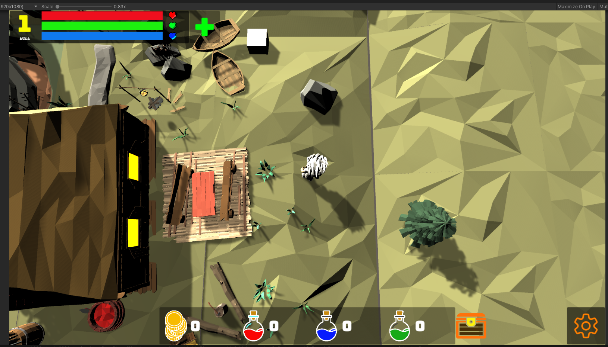
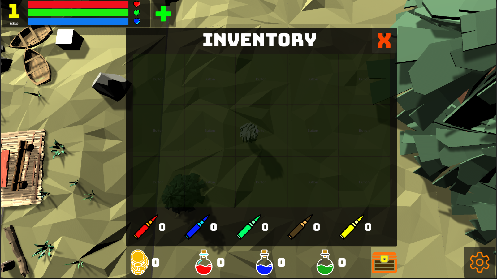

Sure, here's an example README.md file for your Online Chaos game repository on GitHub:

# Online Chaos

Online Chaos is an online RPG game developed in Unity for PC and mobile. The game uses Mirror as the core for networking with some modifications to support players and network objects in multiple scenes at the same time.

## Gameplay

The controls for playing Online Chaos are as follows:

    W, A, S, D keys to move the player character
    Spacebar to jump
    Mouse for look around, shooting, and using abilities
    Shift to use a dash ability
    E to use the player character's special ability
    Escape to pause the game

## Screenshots

Here are some screenshots of Online Chaos in action:

## License

Online Chaos is distributed under a proprietary license, which means that the game's source code is not available to the public, and users cannot modify or distribute the game.

## Acknowledgments

We would like to thank the following channels for their help in developing Online Chaos:

- @Unity3dCollege for their helpful Unity tutorials on YouTube
- @CodeMonkeyUnity for their informative game development videos on YouTube

## Developers

Online Chaos is being developed by me, Williams Tamayo and Roberto Polanco who is also a game developer.

## Download

Online Chaos is currently in development and is not yet available for download. Stay tuned for future updates!
